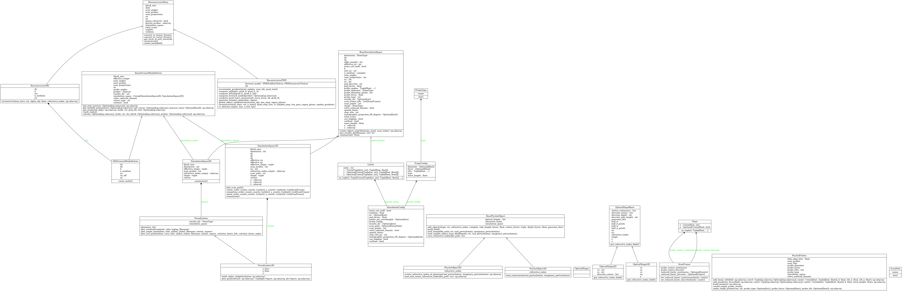

# Class Structure of Thick_Ptycho

The class structure is a bit complex and circular so could benefit from a refactor in the future.

## Current Flow (Very Tangled)
$$Reconstruction \rightarrow ForwardModel \rightarrow Simulation \leftarrow Config$$

## A Proposed Flow (Hierarchical)

1. **Level 0 (Core):** 
    * Data Structures, Basic Operations and Configs.

1.  **Level 1 (Ptycho Basic Objects):** 
    * Probe, Object, Scan classes (Imports `core`).

2.  **Level 2 (Physics):** 
    * Forward Models PWE, Multislice (Imports `ptycho_basic_objects`, calculates wave propagation).

3.  **Level 3 (Application):**
    * `thick_ptycho.simulation` (Imports `core` + `forward_model` to create simulated data).
    * `thick_ptycho.reconstruction` (Imports `core` + `forward_model` to solve for object).
