# Theory of Ptychography and Thick Sample Modeling

## What is Ptychography?

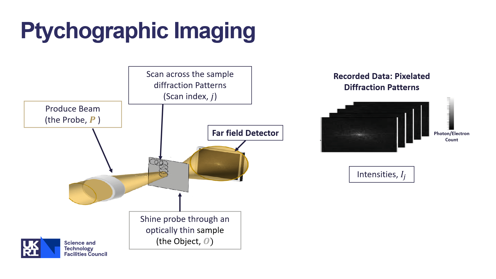

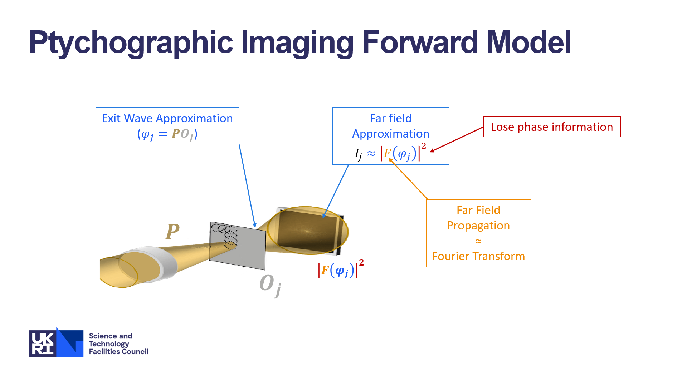

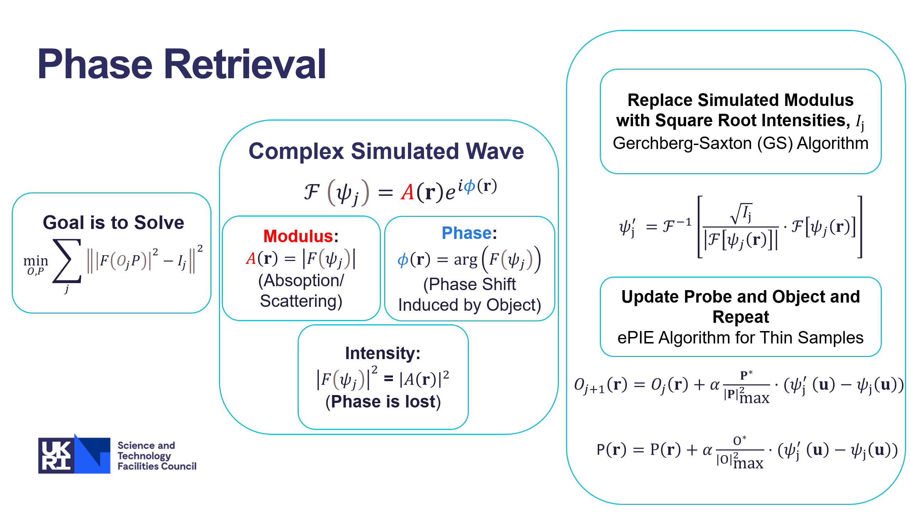

## Helmoltz Equation

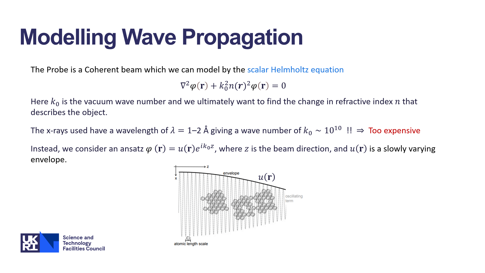

## Thin Sample Approximation

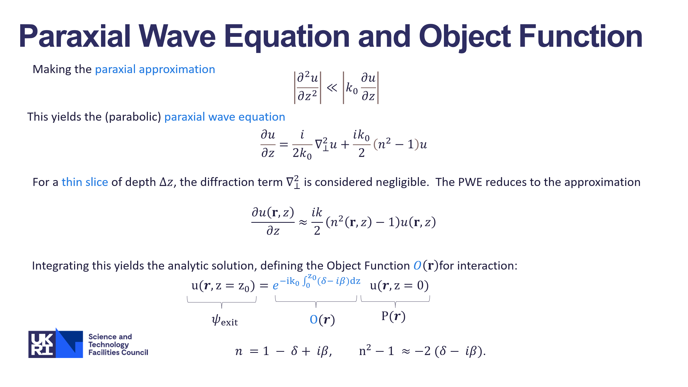

## Multislice Method for Thick Samples

#### Angular Spectrum Method

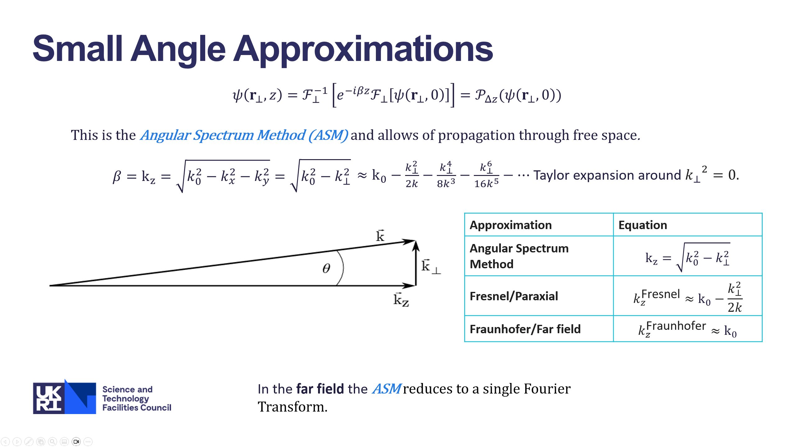

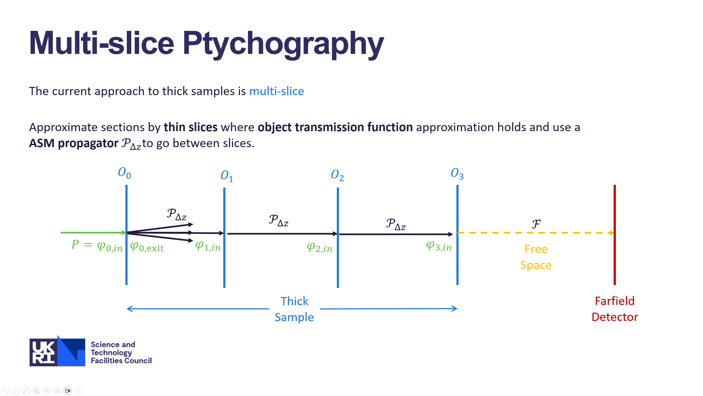

## Wave Propagation Models for Thick Samples (PWE)

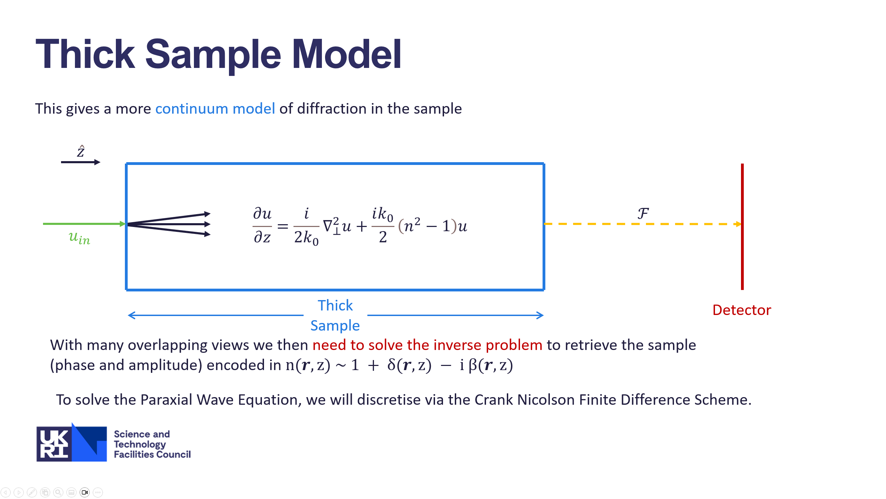

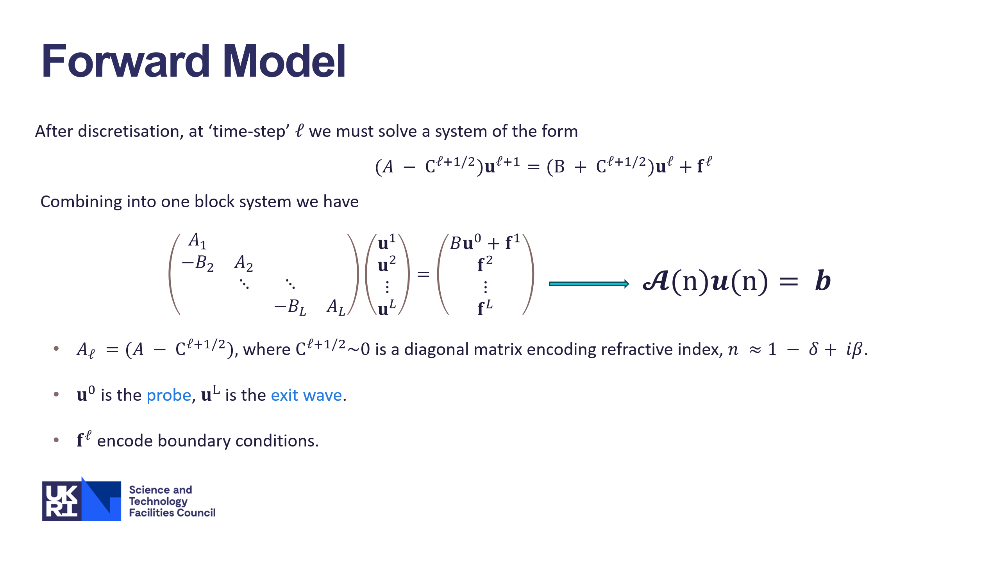

### Inverse Problem for the Paraxial Wave Equation

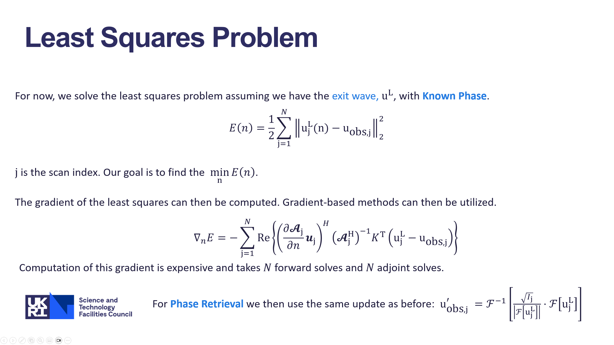

### Preconditioners for Paraxial Wave Equation Solve

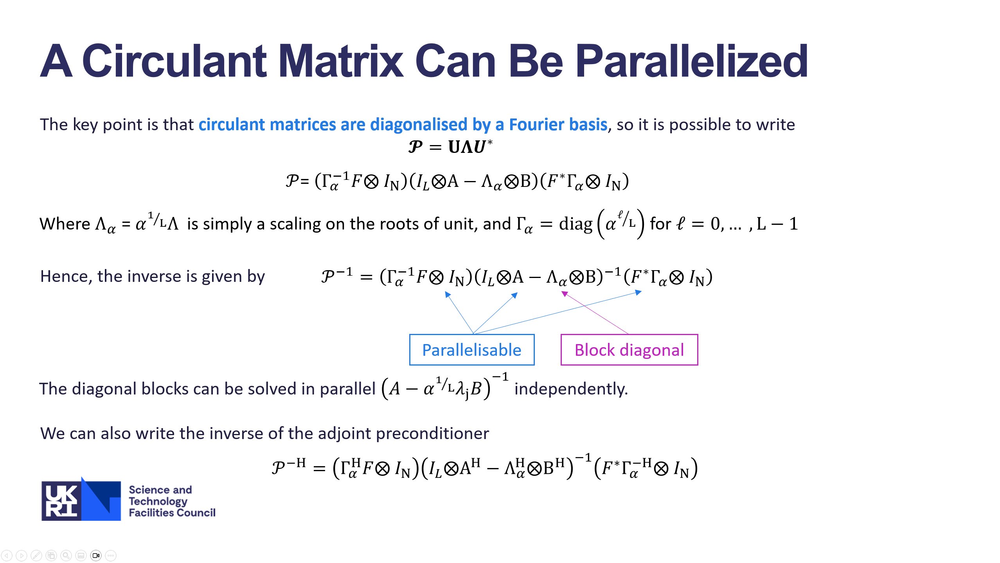

## Future Work and References

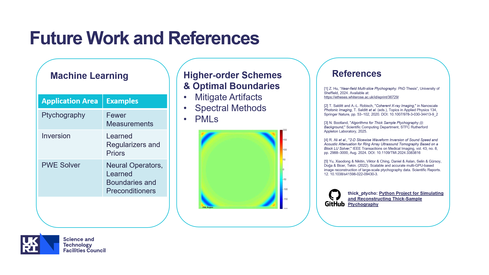